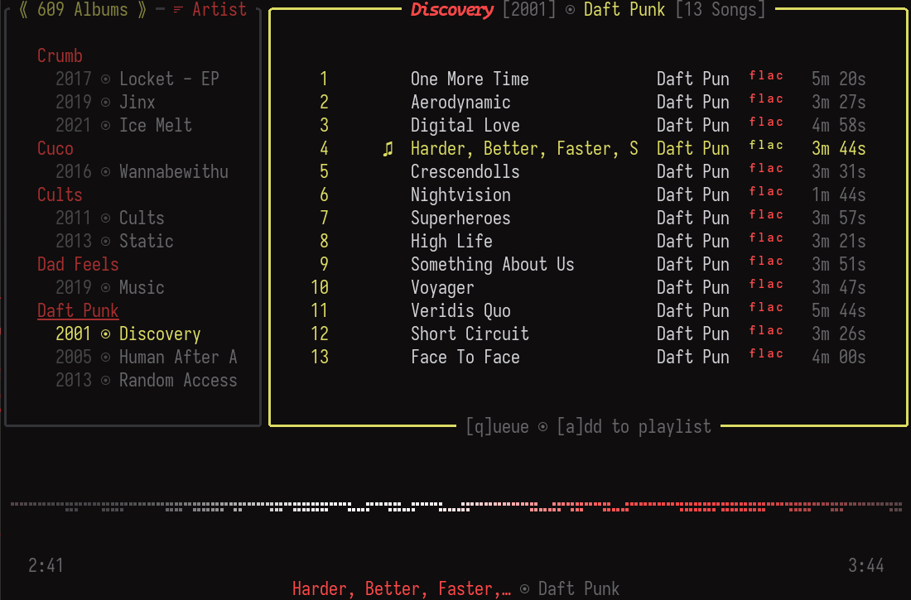

<h1 style="text-align: center"> NoctaVox [v0.2.2]

[](https://ratatui.rs/)
</h1>

NoctaVox is a lightweight, plug and play, TUI music player for local music.



## Features

- Gapless playback with queue support
- Multi-format audio (mp3, m4a, wav, flac, ogg, opus)
- Live library reloading
- Custom themeing with hot reload
- Vim-like keybindings
- Waveform and oscilloscope visualiztion
- Playlist management

## Installation

```bash
git clone https://github.com/Jaxx497/noctavox/
cd noctavox

# Run directly (use the release flag for best audio experience)
cargo run --release 

# Or install globally
cargo install --path noctavox
# and run with the following:
vox
```

## Quick Start


On first launch, you'll be prompted to set root directories for your music
library. Access this menu anytime with the `` ` `` / `~` key.

**Navigation:** `hjkl` or arrow keys  
**Playback:** `Space` to toggle playback, `Enter` to play  
**Seeking:** `n` +5 secs, `p` -5 secs  
**Search:** `/`  
**Reload library:** `F5` or `Ctrl+u`  
**Reload theme:** `F6`

See the complete [keymap documentation](./docs/keymaps.md) for much more

## Themeing

NoctaVox supports custom themeing. The most recent specification for the
themeing engine can be found by refering to the [themeing
specification](./docs/themes.md). 

## Notes

Supported formats: `mp3`, `m4a`, `wav`, `flac`, `ogg`, `opus` \
Container formats are not currently supported: (e.g. `webm`, `mkv`, etc.)

FFmpeg is an optional dependency which enables the waveform visualization
functionality. Without ffmpeg installed, the functionality will simply fallback
onto a different visualization method.

NoctaVox never writes to user files and does not have any online capabilities.
The program does however rely on accurate tagging, but does not supply a method
for editting tags. It's strongly recommended that users ensure their libraries
are properly tagged.

> **Tip:** NoctaVox supports hot reloading by pressing `Ctrl+u` or `F5` at any
> point during runtime. The reload will reflect updated metadata, new
> additions, removals, and more, without needing go restart the runtime.

## Voxio Backend 

For NoctaVox to recognize its true potential, a custom backend was written-
Voxio. It's an extremely simple audio playback engine designed to play audio at
the highest quality, while also supporting the OPUS filetype and gapless
playback; features that have proven hard to come by in more stable projects.
This backend is being actively developed to increase user satisfaction and
reduce decoding errors.

## Roadmap 

- Additional user config options (framerate, backend selection)
- Enhanced info display
- Expanded format testing
- Playlist import/export functionality

## Other

NoctaVox is a hobby project primary written for educational purposes. This
project seeks to demonstrate my understanding of a series of programming
fundamentals, including but not limited to multi-threading, atomics, string
interning, database integration, de/serialization, memory management, integrity
hashing, session persistence, OS operations, modular design, view models, state
management, user customization, and much more. 

