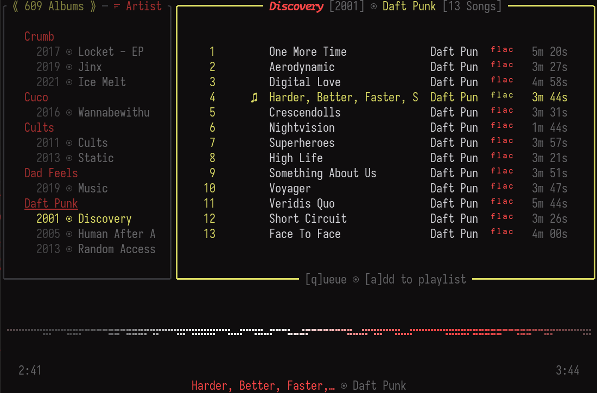

<div align="center">
<h1>NoctaVox
</h1>

[](https://crates.io/crates/noctavox)
[](https://ratatui.rs)  

**A lightweight, Rust-powered TUI music player designed for local libraries and
terminal workflows.** 
</div>



## Features

- Gapless playback
- Queue support
- Playlist management
- Multi-format audio ```mp3, m4a, wav, flac, ogg, opus```
- Live library reloading
- Custom theming with hot reload
- Vim-inspired key-bindings
- Minimal-view mode (pictured above)
- Smart search matches against title, album and artist
- Waveform, oscilloscope, and spectrum visualizations
- Integration with system media controls

## Installation

##### Prebuilt binaries are available on the [releases page](https://github.com/Jaxx497/NoctaVox/releases).

#### Cargo *(recommended)*
```bash
cargo install noctavox --locked 
```

#### Build Git Version

```bash
git clone https://github.com/Jaxx497/noctavox/
cd noctavox

# Run directly (use the release flag for best audio experience)
cargo run --release 

# Or install globally
cargo install --path noctavox

# and run with the following command:
vox
```

## Quick Start

Upon the first launch, NoctaVox will prompt the user to set up a root directory
to scan. Roots can be added or removed from this menu at anytime via the `` `
`` or `~` (backtick and tilde) keys.

**Navigation (Scrolling):** `j` `k` or vertical arrow keys  
**Navigation (Panes):** `h` `l` or horizontal arrow keys  
**Playback:** `Space` to toggle playback, `Enter` to play  
**Seeking:** `n` +5 secs, `p` -5 secs  
**Search:** `/`  
**Add to queue**: `q`  
**Reload library:** `F5` or `Ctrl`+`u`  
**Reload theme:** `F6`  
**Toggle minimal mode:** `m`

See the complete [keymap documentation](./docs/keymaps.md) for much more

## Config

> **Note:** This feature is currently only for the Git version.

NoctaVox allows for global configuration adjustments. This is still an
in-progress feature. Default values are supplied if no config file is present
or if a field is missing/invalid. To adjust the configurations, create a
`config.toml` file inside of the `$CONFIG/noctavox/` directory.

```toml
framerate = 120     # accepts values between 20 and 300 
                    # default: 60

auto_resume = true  # if a track was playing when shutdown, resume playback on startup
                    # default: false

broadcast = false   # enable broadcast features for scrobbling/Discord rich presence
                    # default: false
```

## Theming


NoctaVox contains a simple and easy to learn theming engine. The most recent
specification for custom theming can be found by refering to the [theme
specification](./docs/themes.md). 

A set of pre-made themes can be installed with the `install-theme` script. 

##### Linux
```bash
# from the repo root
chmod +x ./install-themes.sh
./install-themes.sh
```

##### Windows Powershell

```powershell
# from the repo root
./install-themes.ps1
``` 

## About

Supported formats: `mp3`, `m4a`, `wav`, `flac`, `ogg`, `opus` \
Container formats are **not** currently supported (e.g. `webm`, `mkv`) but they
will be at some point.

FFmpeg is an ***optional*** dependency which enables the waveform visualization
functionality. Without ffmpeg, the functionality will simply fallback onto a
different visualization method.

NoctaVox never overwrites user files and does not have any online capabilities.
The program does rely on accurate tagging, and does not supply a method for
editting tags. It's strongly recommended that users ensure their libraries are
properly tagged. 

> **Tip:** NoctaVox supports hot reloading by pressing `Ctrl+u` or `F5` at any
> point during runtime. The reload will reflect updated metadata, new
> additions, and removals, without needing to restart the runtime.

## Voxio Backend 

In order for NoctaVox to recognize the intended vision without compromise, a
custom backend was written- Voxio. It's an extremely simple audio playback
engine designed to play audio at the highest quality, while also supporting the
OPUS filetype and gapless playback; features that have proven hard to come by
in more mature projects. This backend is being actively developed to increase
user satisfaction and reduce decoding errors. 

As of version 0.2.6, Voxio has been moved into its own repository, feel free
to view it here: \
https://github.com/Jaxx497/Voxio/

## Roadmap 

- Playlist import/export functionality
- ReWrite Voxio
    - Enable container formats!

## Other

NoctaVox is a hobby project primary written primarily for educational purposes.
This project seeks to demonstrate an understanding of a variety of programming
fundamentals, including but not limited to multi-threading, atomics, string
interning, database integration, de/serialization, memory management, integrity
hashing, session persistence, OS operations, modular design, view models, state
management, user customization, cross-platform development and much more. 
